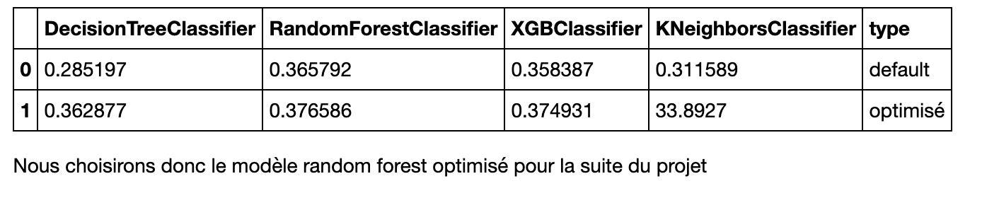

# Python-OnlineNewsPopularity
## Introduction

Ce projet à pour but d'étudier le "Online News Popularity Data Set", un data set qui nous a été fournis par "UCI Machine Learning Repository". Cette base de données référencie l'ensemble des articles publiés par un un site d'actualité pour une période de 2 ans. Le site web en question n'est autre que "Marshable" fondé par Pete Cashmore en juillet 2005.

À terme notre objectif est de mettre en place des modèles de machine learning afin de prédire la popularité (nombre de partage) d'un article donné.

## Données

Pour ce travail nous avons à notre disposition un jeu de données composé de 39644 articles, 58 colonnes prédictives, 1 colonnes cibles (nombre de partages) ainsi que 2 colonnes annexes : 
  
  - Timedelta : nombre de jours entre la publication de l'article et l'acquisition du data set par l'UCI (fournisseur des données), cette colonnes nous a servit à déterminé la periode de notre jeu de données (39644 articles datant du 07-01-2013 juqu'au 31-12-2014), elle a été par la suite supprimé.
  
  - url : url de l'article, cette colonne a été transformé afin de récupéré le nom de chacun des articles, ce qui nous a été utile pour l'implémentation de l'api.
  
La colonne cible a été discrétisé, afin de facilité la prédiction et ainsi avoir un problème de classification. Cette discrétisation à suivit les règles suivantes :
  - Non populaire : < 708 partages (10% des articles)
  - Peu populaire : 708 <= & < 1100 partages (25% des articles)
  - Neutre : 1100 <= & < 2000 partages (30% des articles)
  - Populaire : 2000 <= & < 6100 partages (25% des articles)
  - Très populaire : >= 6100 partages (10% des articles)

## Modèles

Afin de résoudre se problème nous avons mis en place quatre modèles de machine learning, afin de savoir lequels des quatre serait le plus performant.
Dans un premier temps nous les avons comparé les uns aux autres sans aucun paramétrage, avec un random_state à 42. Puis dans un second temps nous les avons affinées à l'aide de grilles de paramètres afin d'opetnir les meilleurs résultats possibles :
 
 - Decision Tree : 
    - min_impurity_decrease : 0.001,
    - max_depth : 8,
    - criterion : entropy
 - KNN : 
    - n_neighbors : 73
 - Random Forest :
    - n_estimators : 4980
 - XGBoost : 
    - learning_rate : 0.1
    - max_depth : 8
    - min_child_weight : 3
    - colsample_bytree : 0.6
   
   
## Résultats

## API

Afin exposer notre modele et de le rendre facilement utilisable, nous avons mis en place une api avec 3 end-points : 

  - '/' : permet de vérifier que l’api est accessible 
  - '/articles' : permet de récupérer la liste des articles via une requête GET
  - '/popularity' : permet de prédire la popularité d’un article ou plusieurs d’articles selectionnés depuis la liste d'articles fournis par le end-point '/articles'
  
Nous avons par la suite utilisé l'outils PostMan afin de tester l'api comme il se doit.

## Technologies 

- Python / Jupyter : L'ensemble du projet
- SKLearn : Modèles de ML
- Pandas : Gestion des données
- Seaborn / Matplotlib : Visualisation des données
- Flask : API

